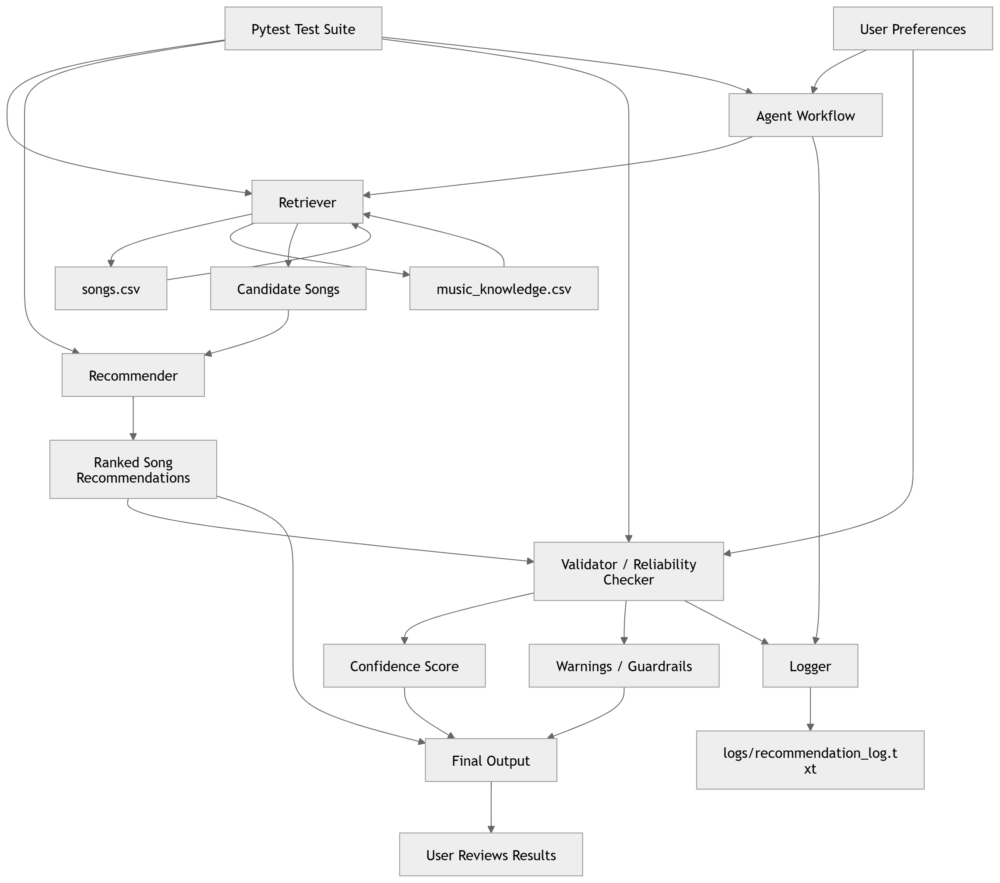
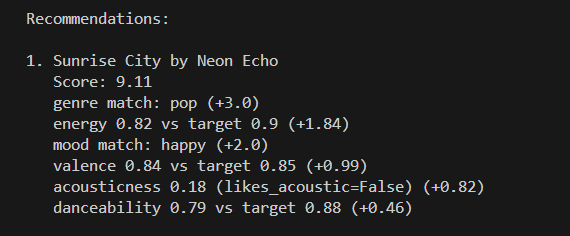
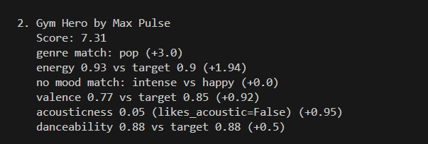
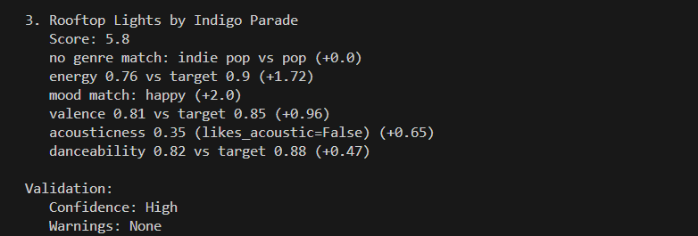
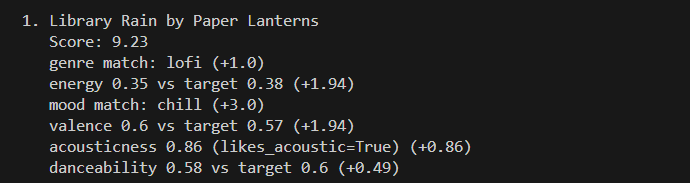
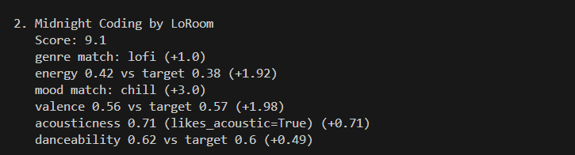
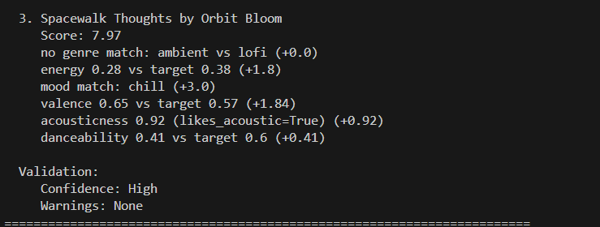
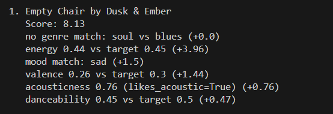
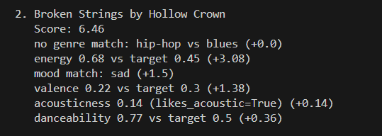
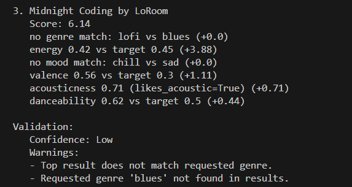

# VibeGuide: Explainable Music Recommendation Assistant

## Original Project (Module 3)

This project builds on my earlier Music Recommender Simulation from Module 3. In that version, we worked with a rule-based system that recommends songs based on user preferences like genre, mood, energy, and acousticness. It scores each song, ranks them, and shows explanations for why each song was recommended.

The system was transparent and easy to understand, but it had an important limitation: it could not evaluate whether its recommendations were actually correct. It always produced results without questioning them.

---

## Project Summary

In this final version, I enhanced the original recommender into a more complete applied AI system.

The system still recommends songs using the same scoring logic, but now it also evaluates its own output. It retrieves relevant candidates, ranks them, checks whether the results match the user’s intent, and provides a confidence score along with warnings when something is wrong.

The goal of this project is to make the system more trustworthy, transparent, and closer to how real-world AI systems behave.

---

## How The System Works

Real-world recommendation systems often rely on large amounts of user behavior data. This system continues to use a content-based approach, but now includes additional AI-style components.

Instead of only scoring songs, the system now follows a multi-step workflow:

- It first retrieves a subset of relevant songs  
- Then it scores and ranks them  
- Then it validates whether the results match the user’s request  
- Finally, it outputs recommendations along with confidence and warnings  

This makes the system not only explainable, but also self-aware of its limitations.

---

## The Dataset

The catalog is stored in `data/songs.csv` and contains 18 songs covering a wide range of genres and moods.

Genres covered include:
pop, lofi, rock, ambient, jazz, synthwave, indie pop, hip-hop, classical, edm, country, r&b, metal, soul, reggae

Moods covered include:
happy, chill, intense, relaxed, moody, focused, sad, melancholic, euphoric, nostalgic, romantic, aggressive

Each song includes attributes such as:
- genre (categorical)
- mood (categorical)
- energy (0–1)
- valence (0–1)
- danceability (0–1)
- acousticness (0–1)

These features are used by the recommender to calculate similarity with user preferences.

---

## The User Profile

Each user is represented as a dictionary with preferences such as:

- genre  
- mood  
- energy  
- valence  
- acoustic  

Numerical features use proximity scoring, meaning the system tries to find songs closest to the user’s target values rather than simply maximizing or minimizing them.

---

## The Algorithm (Original Logic)

The recommender still uses the same scoring system from the original project.

Each song earns points based on:
- genre match  
- mood match  
- energy similarity  
- valence similarity  
- acoustic preference  
- danceability similarity  

Songs are then ranked by total score and the top results are returned.

This logic was not replaced, but extended.

---

## New System Workflow (Applied AI Enhancement)

The system now runs as a pipeline:

User Input → Agent → Retriever → Recommender → Validator → Output

- **Retriever** filters relevant candidate songs  
- **Recommender** scores and ranks them  
- **Validator** checks if results match the request  
- **Agent** controls the full process  
- **Logger** records each run  

This makes the system modular, testable, and more realistic.

---

## System Diagram

---

## Sample Output

### Example 1 (Normal Case)

Input:  
genre=pop, mood=happy, energy=0.9  

Output:  
Top songs: Sunrise City, Gym Hero, Rooftop Lights  
Confidence: High  
Warnings: None  

---

### Example 2 (Another Normal Case)

Input:  
genre=lofi, mood=chill  

Output:  
Top songs: Library Rain, Midnight Coding, Spacewalk Thoughts  
Confidence: High  
Warnings: None  

---

### Example 3 (Failure Case / Edge Case)

Input:  
genre=blues (not in dataset)  

Output:  
Top songs: Empty Chair, Broken Strings  
Confidence: Low  

Warnings:  
- Requested genre not found  
- Top result does not match requested genre  

---

## Reliability and Evaluation

I tested the system using multiple methods.

First, I used automated tests with `pytest`. There are 6 tests that check the recommender, retriever, validator, and agent workflow. All tests passed.

Second, I added confidence scoring. The system labels outputs as High, Medium, or Low depending on how well the results match the user’s request.

Third, I added warnings and guardrails. The system detects missing genres and mismatches and clearly reports them.

Finally, I compared outputs between the original system and the new system. The new version behaves the same in normal cases but performs better in edge cases by identifying problems.

---

## Design Decisions

I chose to keep the original scoring system because it is simple, transparent, and easy to explain.

Instead of replacing it, I added new layers:
- retrieval to narrow down candidates  
- validation to check results  
- confidence scoring to communicate uncertainty  

The trade-off is that the system does not learn from data like a machine learning model, but it is much easier to understand and debug.

---

## Known Limitations

- The dataset is small (18 songs)  
- The system does not learn from user behavior  
- Mood matching is still binary  
- It does not detect contradictory preferences yet  
- It cannot discover new patterns beyond the dataset  

---

## Setup Instructions

1. Clone the repository  
2. Install dependencies  
3. Run the system:

python -m src.main  

4. Run tests:

pytest  

---

## Reflection

This project helped me understand that building an AI system is not just about generating outputs.

It is also about evaluating those outputs and being honest about their limitations.

By adding validation, confidence scoring, and warnings, I made the system more realistic and closer to how real-world AI systems behave.

I also learned that breaking a system into components like retriever, recommender, and validator makes it easier to build, test, and improve.

## Demo Video

[Watch Demo Video](assets/demo.mp4)